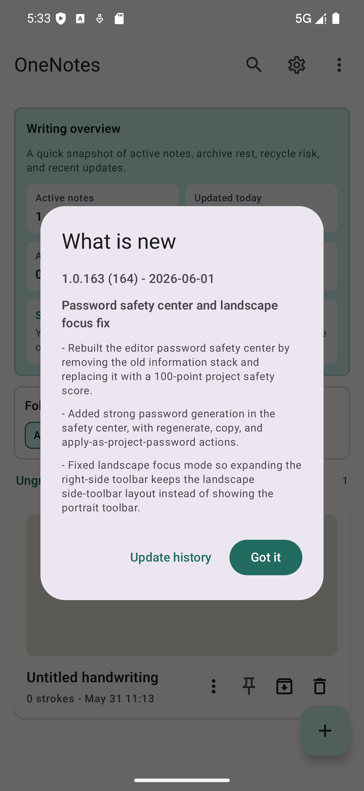
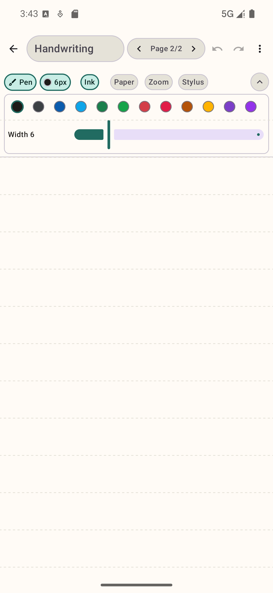
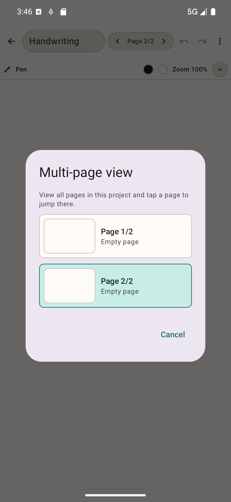
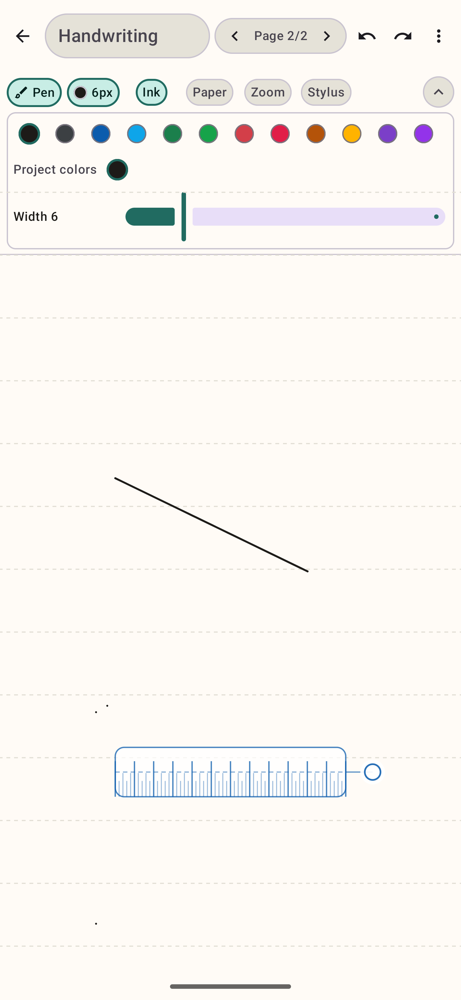
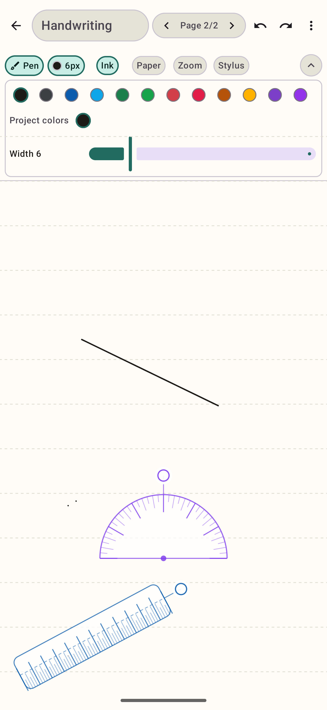
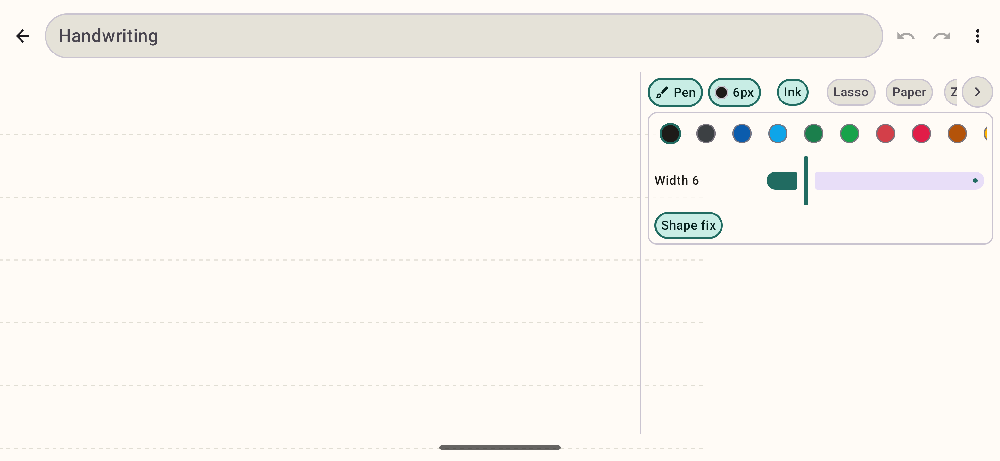
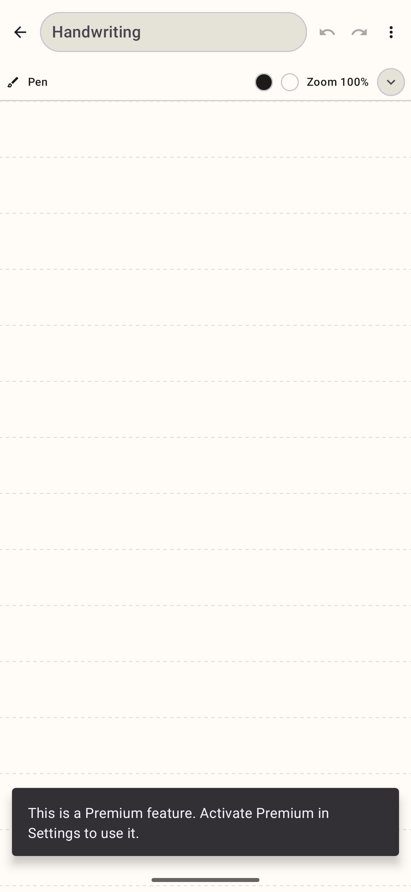
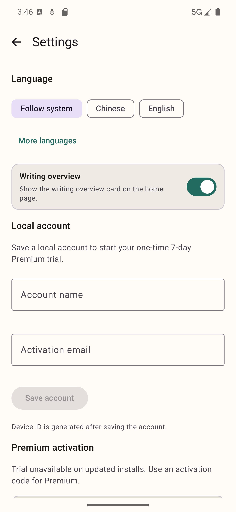

#  OneNotes

**私密、安全、流畅的手写笔记工具**
**Private, secure, and fluid handwriting notes**

---

## 截图 / Screenshots

| 首页 / Home | 编辑器 / Editor | 工具栏 / Toolbar |
|:---:|:---:|:---:|
|  |  |  |

| 多页视图 / Multi-page | 直尺 / Ruler | 量角器 / Protractor |
|:---:|:---:|:---:|
|  |  |  |

| 横屏编辑 / Landscape | 密码保护 / Password | 设置 / Settings |
|:---:|:---:|:---:|
|  |  |  |

---

## 中文介绍

OneNotes 是一款面向手写记录、灵感整理和长期项目沉淀的 Android 本地笔记应用。它围绕「写得顺手、找得方便、数据更安心」设计，适合课堂笔记、会议记录、草稿推演、读书摘录、日常计划和创意整理。

### 适合谁用？

- **学生** — 课堂笔记、数学草稿、康奈尔笔记法、复习计划
- **职场人士** — 会议记录、项目草稿、PDF 资料批注、分享汇报
- **创作者** — 灵感速记、手账日记、阅读摘录、创意整理
- **工程师** — 推演草稿、架构画图、公式记录、截图标注

### 核心特性

- **低延迟手写引擎** — 支持触控笔压感、倾斜、方位角，笔迹跟手流畅，防误触优化
- **无限画布与多页项目** — 自由缩放、移动、分页，适合长篇笔记和大型推演
- **专业工具集** — 直尺、量角器、几何工具、套索选择、形状识别、手绘表格识别
- **数学笔迹标准化** — 手写数学公式与符号自动标准化
- **9 种语言** — 中文、英文、法文、德文、西班牙文、印地文、阿拉伯文、葡萄牙文、日文
- **本地隐私优先** — 笔记内容加密存储，支持项目级密码保护
- **加密备份与恢复** — 本地加密备份，WebDAV 加密同步（高级版）
- **桌面小组件** — 多种尺寸的桌面快捷笔记小组件
- **分享图生成** — 精美分享图片，多种版式与社交模板
- **性能预算策略** — 大画布分块渲染、低内存自动降级、后台任务智能调度
- **持续迭代** — 200+ 个版本迭代，每周持续改进

### 高级版功能

- 更多笔刷与纸张模板
- 自定义纸张颜色
- 精准缩放与项目密码
- WebDAV 加密同步
- 智能复习计划与专注仪表盘
- 创意洞察与归档分析
- 精美分享图与智能文案
- 演示聚光灯与构图辅助线

---

## English Introduction

OneNotes is a local Android note-taking app designed for handwriting, idea organization, and long-term project building. It is built around three principles: **smooth writing, easy finding, and data safety** — ideal for class notes, meeting records, draft reasoning, reading excerpts, daily planning, and creative work.

### Who is it for?

- **Students** — Class notes, math drafts, Cornell note-taking, review planning
- **Professionals** — Meeting records, project drafts, PDF annotation, share reports
- **Creators** — Idea capture, journaling, reading notes, creative organization
- **Engineers** — Reasoning drafts, architecture sketches, formula notes, screenshot markup

### Key Features

- **Low-latency writing engine** — Stylus pressure, tilt, and azimuth support with palm rejection and live ink smoothing
- **Infinite canvas & multi-page projects** — Free zoom, pan, and pagination for long notes and complex diagrams
- **Professional toolset** — Ruler, protractor, geometry tools, lasso selection, shape recognition, hand-drawn table recognition
- **Math ink normalization** — Handwritten math formulas and symbols are automatically standardized
- **9 languages** — Chinese, English, French, German, Spanish, Hindi, Arabic, Portuguese, Japanese
- **Local-first privacy** — Note content is encrypted at rest; project-level password protection supported
- **Encrypted backup & restore** — Local encrypted backups; WebDAV encrypted sync (Premium)
- **Home screen widgets** — Multiple widget sizes for quick note access
- **Share image generation** — Beautiful share images with multiple layouts and social templates
- **Performance budget policy** — Tile-based canvas rendering, automatic low-memory degradation, smart background scheduling
- **Continuously improved** — 200+ version iterations, weekly updates

### Premium Features

- More brushes and paper templates
- Custom paper colors
- Precision zoom and project passwords
- WebDAV encrypted sync
- Smart review planner and focus dashboard
- Creative insights and archive analysis
- Premium share images and smart captions
- Presentation spotlight and composition guides

---

## 功能对比 / Feature Comparison

| 功能 / Feature | OneNotes | 云记 | Squid | 享做笔记 |
|---|:---:|:---:|:---:|:---:|
| 无限画布 / Infinite canvas | ✅ | ❌ | ✅ | ❌ |
| 多页项目 / Multi-page | ✅ | ✅ | ✅ | ✅ |
| 触控笔压感 / Stylus pressure | ✅ | ✅ | ✅ | ✅ |
| 直尺量角器 / Ruler & protractor | ✅ | ✅ | ❌ | ✅ |
| 形状识别 / Shape recognition | ✅ | ❌ | ❌ | ✅ |
| 手绘表格识别 / Table recognition | ✅ | ❌ | ❌ | ❌ |
| 数学公式标准化 / Math normalization | ✅ | ❌ | ❌ | ❌ |
| 项目密码 / Project password | ✅ | ❌ | ❌ | ✅ |
| 加密备份 / Encrypted backup | ✅ | ❌ | ❌ | ❌ |
| WebDAV 同步 / WebDAV sync | ✅ | ❌ | ❌ | ✅ |
| 桌面小组件 / Home widget | ✅ | ❌ | ❌ | ✅ |
| 分享图生成 / Share image | ✅ | ✅ | ❌ | ✅ |
| 笔迹回放 / Stroke playback | ✅ | ❌ | ❌ | ❌ |
| 笔迹热力图 / Stroke heatmap | ✅ | ❌ | ❌ | ❌ |
| 多语言 / Multilingual (9种) | ✅ | 2种 | 10+ | 2种 |
| 本地隐私优先 / Local-first privacy | ✅ | ❌ | ✅ | ❌ |
| 免费试用 / Free trial | 7天高级版 | 基础免费 | 付费 | 基础免费 |

> 注：以上对比基于公开信息和用户评价，可能随版本更新而变化。
> Note: Comparison based on public information and user reviews; may change with updates.

---

## 下载 / Download

最新版本请前往 [Releases](https://github.com/tourisain/OneNotes/releases) 页面下载 APK 文件。

For the latest version, please visit the [Releases](https://github.com/tourisain/OneNotes/releases) page to download the APK.

### 系统要求 / System Requirements

- Android 8.0 (API 26) 或更高版本 / or higher
- 支持触控笔的设备体验更佳 / Stylus-supported devices recommended

### 快速安装 / Quick Install

1. 下载最新的 `.apk` 文件 / Download the latest `.apk` file
2. 在手机上允许「未知来源安装」/ Allow "Install from unknown sources" on your phone
3. 点击安装 / Tap to install

---

## 最近更新 / Recent Updates

查看最近 5 个版本 / View last 5 versions

### v1.0.286 — Firebase 基础配置接入 / Firebase base configuration
- Firebase 配置文件接入，Google services 插件声明，Firebase BoM 引入
- Firebase config integration, Google services plugin, Firebase BoM

### v1.0.285 — 书写手感中心与资料批注增强 / Writing feel center and annotation import
- 书写诊断一键推荐配置，Android 官方速记入口，PDF 批注策略
- Writing diagnostics one-tap settings, system note entry, PDF annotation policy

### v1.0.284 — 首页快速入口与高级版价值展示 / Home shortcuts and Premium value cards
- 空首页快速草稿入口，书写诊断统一策略，高级版三张价值卡
- Empty-home shortcuts, unified writing diagnostics, three Premium value cards

### v1.0.283 — 六阶段吸引力与体验收束 / Six-stage attraction and experience focus
- 首页吸引力策略，编辑器工具栏表面策略，更新说明编码修复
- Home attraction policy, editor toolbar surface policy, update text encoding fix

### v1.0.282 — 八阶段精简与稳定基础升级 / Eight-stage polish and stability foundation
- 分块渲染预算策略，触控笔体验策略，文件导入抗压策略
- Tile-rendering budget, stylus experience policy, import pressure policy

完整更新记录请参阅 [CHANGELOG.md](CHANGELOG.md)（200+ 个版本）。

For full version history, see [CHANGELOG.md](CHANGELOG.md) (200+ versions).

---

## 技术栈 / Tech Stack

| 技术 / Technology | 说明 / Description |
|---|---|
| Kotlin | 主要开发语言 / Primary language |
| Jetpack Compose | 声明式 UI 框架 / Declarative UI framework |
| Hilt | 依赖注入 / Dependency injection |
| Room | 本地数据库 / Local database |
| DataStore | 加密偏好存储 / Encrypted preferences |
| Coroutines | 异步编程 / Asynchronous programming |
| OkHttp | 网络通信 / Network communication |
| Google Play Billing | 内购支付 / In-app purchases |
| Firebase | 基础服务 / Base services |
| R8 / ProGuard | 代码混淆与压缩 / Code shrinking and obfuscation |

---

## 隐私与安全 / Privacy & Security

### 中文

OneNotes 重视本地隐私与数据安全：

- 笔记内容、本地账户、高级版激活信息以加密方式保存
- 重要项目可设置独立密码
- 备份和恢复使用加密传输
- WebDAV 同步使用加密通道
- 不收集不必要的用户数据
- 不包含第三方追踪 SDK

### English

OneNotes prioritizes local privacy and data security:

- Note content, local accounts, and premium activation data are encrypted at rest
- Important projects can be protected with individual passwords
- Backups and restores use encrypted transfer
- WebDAV sync uses encrypted channels
- No unnecessary user data collection
- No third-party tracking SDKs

---

## 支持的语言 / Supported Languages

| 语言 / Language | 代码 / Code |
|---|---|
| 中文 | zh |
| English | en |
| Français | fr |
| Deutsch | de |
| Español | es |
| हिन्दी | hi |
| العربية | ar |
| Português | pt |
| 日本語 | ja |

---

## 反馈与支持 / Feedback & Support

- **问题反馈 / Bug Report**: [提交 Issue](https://github.com/tourisain/OneNotes/issues/new)
- **功能建议 / Feature Request**: [提交 Issue](https://github.com/tourisain/OneNotes/issues/new)
- **邮箱 / Email**: tourisain@gmail.com

---

## License

本项目为专有软件，源代码公开供参考学习，但不允许未经授权的商业使用。

This project is proprietary software. Source code is publicly available for reference and learning, but unauthorized commercial use is not permitted.

---

**OneNotes** — 写得顺手，找得方便，数据更安心

*Write smoothly. Find easily. Keep data safe.*

